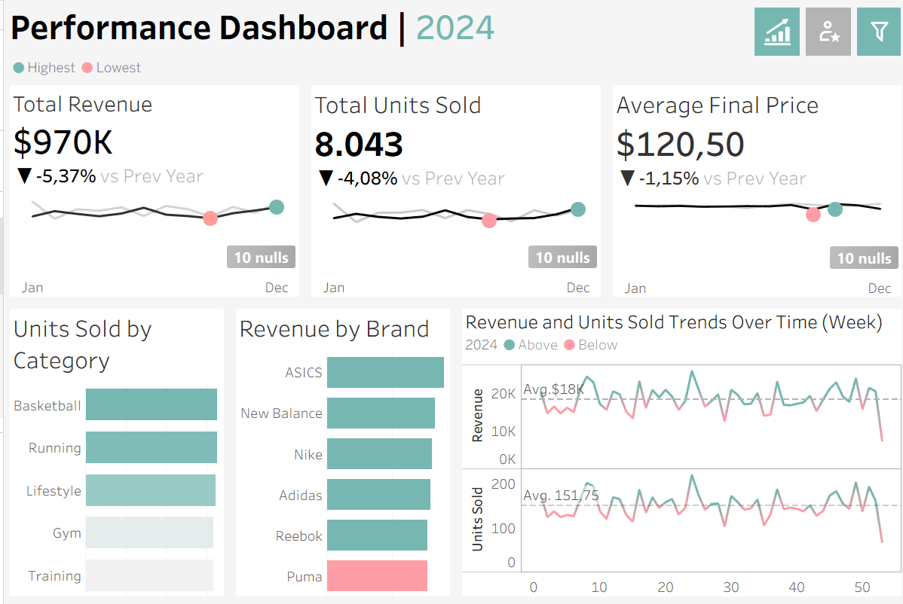
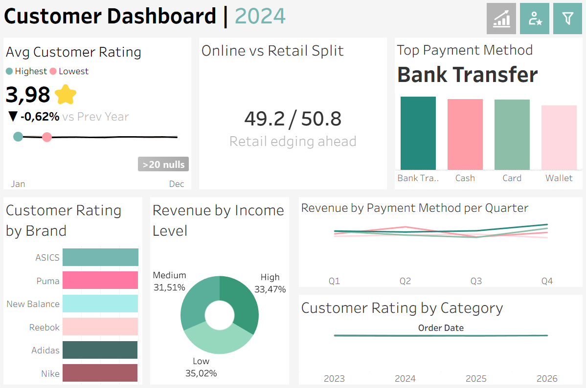

# Sports Footwear Sales & Customer Behavior Dashboard

Interactive Tableau dashboards analyzing sales performance and customer behavior for a sports footwear retailer.

**[View the live dashboard on Tableau Public](https://public.tableau.com/app/profile/zafira.zein/viz/SportsFootwearSalesCustomerBehaviorDashboard/PerformanceDashboard)**

## Preview

### Performance Dashboard

### Customer Dashboard

## Problem Statement

How is the business performing compared to the previous year, which brands and categories drive revenue, and how do customers rate and pay for their purchases? These dashboards answer those questions in two views: one for sales performance, one for customer behavior.

## Dataset

- **Source:** [Sports Footwear Sales and Consumer Behavior (Kaggle)](https://www.kaggle.com/datasets/aliiihussain/sports-footwear-sales-and-consumer-behavior)
- **Subset used:** Filtered to orders from 2023 to 2026 from the original dataset. 
- **Data quality note:** some records contain null values, which are flagged directly on the dashboard KPI cards

## Dashboards

### 1. Performance Dashboard
- KPI cards: Total Revenue, Total Units Sold, Average Final Price, each with year-over-year change and a monthly sparkline
- Units Sold by Category
- Revenue by Brand
- Weekly Revenue and Units Sold trends with average reference lines

### 2. Customer Dashboard
- Average Customer Rating with year-over-year change
- Online vs Retail split
- Top Payment Method
- Customer Rating by Brand
- Revenue by Income Level
- Revenue by Payment Method per Quarter
- Customer Rating by Category over time

## Key Insights

| Metric | 2024 | 2025 |
|---|---|---|
| Total Revenue | $970K (-5.37% YoY) | $1,024K (+5.57% YoY) |
| Total Units Sold | 8,043 (-4.08% YoY) | 8,483 (+5.47% YoY) |
| Average Final Price | $120.50 (-1.15% YoY) | $120.95 (+0.38% YoY) |
| Avg Customer Rating | 3.98 (-0.62% YoY) | 3.98 (+0.03% YoY) |
| Top Revenue Brand | ASICS | New Balance |
| Lowest Revenue Brand | Puma | Puma |
| Top Categories (Units) | Basketball, Running | Basketball, Lifestyle |
| Online / Retail Split | 49.2 / 50.8 | 50.1 / 49.9 |
| Top Payment Method | Bank Transfer | Bank Transfer |

**Performance**
- Revenue rebounded in 2025 after a decline in 2024. Growth was driven by volume (+5.47% units) since average price stayed almost flat, so sales were not boosted by price increases.
- Brand leadership shifted: ASICS led revenue in 2024 but dropped to fifth in 2025, while New Balance moved to first. Puma stayed lowest in both years.
- Basketball stayed the top category, while Lifestyle overtook Running in 2025. Gym was the lowest category in 2025.

**Customer Behavior**
- Customer satisfaction is stable at 3.98 in both years, so the revenue changes did not come with a change in ratings.
- The channel lead flipped from Retail (2024) to Online (2025), but the gap is under 2 points in both years, so the two channels are effectively balanced.
- Bank Transfer is the most used payment method in both years.
- Revenue by income level became more balanced in 2025 (High 33.79%, Medium 33.40%, Low 32.82%). In 2024, Low income led at 35.02%, so the High income segment took the top spot.

## Tools

- Tableau Public / Tableau Desktop
- Kaggle (data source)

## How to Use

1. Open the [live dashboard](https://public.tableau.com/app/profile/zafira.zein/viz/SportsFootwearSalesCustomerBehaviorDashboard/PerformanceDashboard) to explore it interactively.
2. Or download the `.twbx` file from the `workbook/` folder and open it in Tableau Desktop or Tableau Public.

## Author

Zafira Zefina Zein
